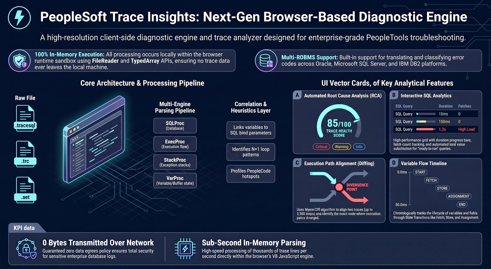

<h1>PeopleSoft Trace Insights</h1>

<strong>Next-Gen Browser-Based Diagnostic Engine for PeopleTools</strong>

A fully client-side trace analyzer for PeopleSoft <code>.tracesql</code>, <code>.trc</code>, and <code>.aet</code> files.
Runs <strong>100% locally in-memory</strong> inside your browser—no uploads, no servers, zero network egress.

<h2>Key Features</h2>
<ul>
  <li><strong>Local-Only Execution:</strong> HTML5 <code>FileReader</code> + TypedArrays, no external calls.</li>
  <li><strong>Multi-Parser Pipeline:</strong> SQL, PeopleCode, Stack, Variable, AE, COBOL.</li>
  <li><strong>Automated RCA & Health Score:</strong> 0–100 score with linked evidence.</li>
  <li><strong>SQL Analytics & N+1 Detection:</strong> Fingerprinting, bind substitution, slow/repeated pattern detection.</li>
  <li><strong>Execution Path Diffing:</strong> Myers-based baseline vs. target trace alignment.</li>
  <li><strong>Variable-to-Bind Correlation:</strong> PeopleCode variables → SQL bind parameters.</li>
  <li><strong>Multi-RDBMS Error Normalization:</strong> Oracle, SQL Server, DB2 mapped to unified categories.</li>
</ul>

<h2>Architecture Overview</h2>
<pre>
+----------------------------------------------------------------------------------+
|                             BROWSER RUNTIME SANDBOX                             |
+----------------------------------------------------------------------------------+
| Trace Input (.tracesql/.trc/.aet) → FileReader → Multi-Parser → Heuristics → UI |
+----------------------------------------------------------------------------------+
| SQL Grid | Exec Tree | Diagnostics | Diff | Variable Flow | RCA Overview        |
+----------------------------------------------------------------------------------+
</pre>

<h2>Getting Started</h2>
<h3>Prerequisites</h3>

Modern desktop browser: Chrome, Edge, Firefox, or Safari.

<h3>Run the Analyzer</h3>
<pre><code>git clone https://github.com/your-username/PSoft-Trace-Insights.git
</code></pre>

Open <code>PSoft-Trace-Insights.html</code> directly in your browser. 
No web server, build step, Node.js runtime, or external dependencies required.

<h2>Workflow Overview</h2>
<table>
  <tr>
    <td><strong>Step 1</strong></td>
    <td>Load trace (<code>.tracesql</code>, <code>.trc</code>, <code>.aet</code>) via drag-and-drop.</td>
  </tr>
  <tr>
    <td><strong>Step 2</strong></td>
    <td>Review Health Score & automated RCA on the Overview dashboard.</td>
  </tr>
  <tr>
    <td><strong>Step 3</strong></td>
    <td>Analyze SQL hotspots, N+1 loops, and bind-substituted statements.</td>
  </tr>
  <tr>
    <td><strong>Step 4</strong></td>
    <td>Inspect Execution Tree, Diagnostics, Variable Flow, and export CSV telemetry.</td>
  </tr>
</table>

<h2>Recommended Trace Settings</h2>
<table>
  <tr>
    <th>Flag</th>
    <th>Use Case</th>
  </tr>
  <tr>
    <td><code>TraceSQL=3</code></td>
    <td>SQL + bind values (standard performance tracing).</td>
  </tr>
  <tr>
    <td><code>TraceSQL=7</code></td>
    <td>SQL + binds + commit/rollback markers.</td>
  </tr>
  <tr>
    <td><code>TracePC=1</code></td>
    <td>PeopleCode flow and call hierarchy.</td>
  </tr>
  <tr>
    <td><code>TracePC=13</code></td>
    <td>PeopleCode + variable tracking.</td>
  </tr>
  <tr>
    <td><code>TraceAE=131</code></td>
    <td>App Engine step timings.</td>
  </tr>
  <tr>
    <td><code>TraceAE=387</code></td>
    <td>Complete AE diagnostics.</td>
  </tr>
</table>

<h2>Multi-RDBMS Error Mapping</h2>
<table>
  <tr>
    <th>Classification</th>
    <th>Oracle</th>
    <th>SQL Server</th>
    <th>DB2</th>
  </tr>
  <tr>
    <td><code>UNIQUE_CONSTRAINT</code></td>
    <td>ORA-00001</td>
    <td>Msg 2627, Msg 2601</td>
    <td>SQL0803N</td>
  </tr>
  <tr>
    <td><code>NULL_INSERT</code></td>
    <td>ORA-01400</td>
    <td>Msg 515</td>
    <td>SQL0407N</td>
  </tr>
  <tr>
    <td><code>OBJECT_NOT_FOUND</code></td>
    <td>ORA-00942</td>
    <td>Msg 208</td>
    <td>SQL0204N</td>
  </tr>
  <tr>
    <td><code>INVALID_IDENTIFIER</code></td>
    <td>ORA-00904</td>
    <td>Msg 207</td>
    <td>SQL0206N</td>
  </tr>
</table>

<h2>License</h2>

MIT License &copy; 2026 PeopleSoft Trace Insights

